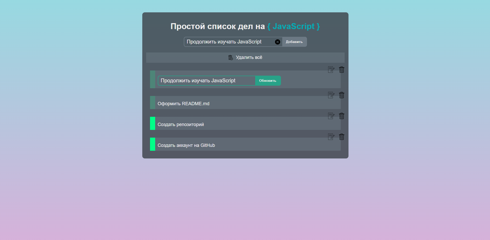

<h1 align="center">To do list</h1>

<h2 align="center"><a  href="https://olzx.github.io/to-do-list/">Демонстрация</a></h2>

## Описание
Простое решение для организации повседневных задач. 
Позволяет добавлять дела в список и помечать их выполненными.
### Имеются следующие возможности:
- Изменение содержимого (текста) у выбранной задачи;
- Удаление всех задач по одному нажатию;
- Удаление выбранной задачи;
- Помечать какие задачи выполнены.
     
### Цели создания этого приложения
<<<<<<< HEAD
- Изучение основ JavaScript;
- Изучение работы Git и GitHub;
=======
- Изучение основ JavaScript
- Изучение работы Git и GitHub
>>>>>>> 79c4e05b12c2d3668a5af98427a792553e473aef
     
### Дополнительная информация
В папке js файл app.js - отвечает за удаление, редактирование, добавление новых задач. В этом файле закомментировано более 90% кода, это может помочь разобраться в работе (что за что отвечает).
## Задачи на будущее
<<<<<<< HEAD
- Добавить оповещение/индикацию об ошибках (не вставлен текст, успешное сохранение и др.);
- Сделать адаптивность;
- <s>Добавить dragDrop;
- Добавить сохранение задач в localStorage.</s>
=======
- Добавить сортировку задач;
- Добавить сохранение задач в куки.
>>>>>>> 79c4e05b12c2d3668a5af98427a792553e473aef
